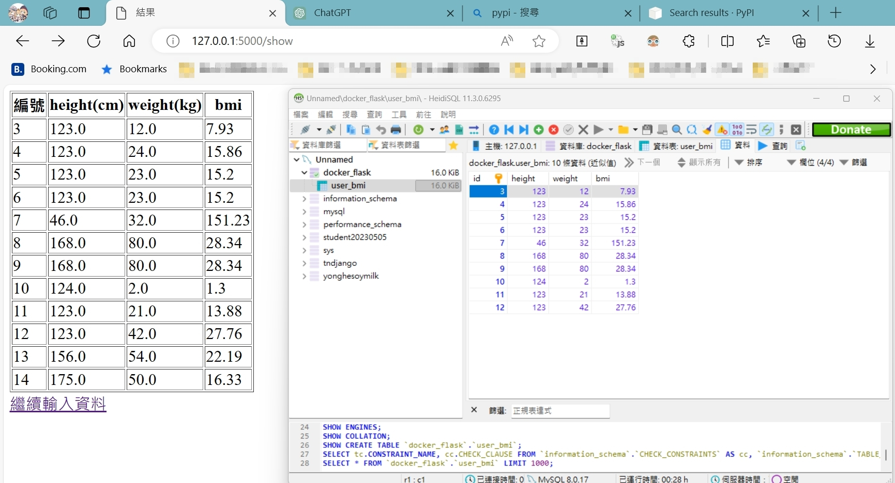

## flask框架部署docker練習

總共分三大方向來執行。

1. flask

   * 開啟docker，先將python映像檔pull下來。
   * 準備好要部署的app.py和templates資料夾。
   * 準備requirements.txt，只需要Flask和mysql-connector-python兩個模組。
   * 打開Cmd，切換至指定路徑。`cd /d C:\Users\user\OneDrive\Desktop\docker\01_bmi`。
2. mysql

   * 先從本地匯出schema資料庫架構/邏輯或稱初始檔案，以及相關初始資料。於cmd內輸入。`mysqldump --no-defaults -u root -p --databases docker_flask --add-drop-database --add-drop-table --complete-insert > bmi_schema.sql`
3. nginx 反向代理

   * 安裝nginx windows版本(1.25.4)，放入Program File內部，將此路徑先複製起來。
   * 同時將C:\Program Files\nginx-1.25.4\conf內的nginx.conf檔案複製到本專案下的C:\Users\user\OneDrive\Desktop\docker\01_bmi\nginx\nginx.conf內部。
   * 將上述兩個路徑複製，待會貼入docker-compose.yml文件。
4. 準備Dockerfile
5. 建立Docker映像 ，`docker build -t myflask .`

   * 若有首次有建立成功，後續重複練習卻建立失敗時，重開機就能解決。
6. 準備docker-compose.yml文件

   * 定義flask應用程式、mysql、nginx的設定。
7. 啟動Docker容器，`docker-compose up`

   * 會先拉mysql、nginx的映像檔。
   * port被占用情形，於docker-compose.yml修改映射主機的port號。
     * 在flask，若本機port:5000被占用，就要將 Flask 應用程序的容器端口進行修改，如"5001:5000"。
     * 在nginx，若本機port:80被占用，就要將 nginx 應用程序的容器端口修改，如"8188:80"。
     * 在mysql，若本機port:3306被占用，就要將mysql應用程序的容器端口修改，如"3307:3306"。
   * 您的 Flask 應用程式運行在 Docker 容器內，則應該停止並重新啟動整個容器堆棧。這可以通過運行 `docker-compose down` 來停止容器，然後再運行 `docker-compose up` 或 `docker-compose up -d` 來重新啟動容器。這將應用新的 MySQL 連接設置並重新啟動 Flask 應用程式。
   * 若是mysql發生沒有資料表的情況，可能是docker-compose up產生問題，這時候只好手動新建資料表(不建議重新賭一次建立成功的機率)並插入現有資料，語法詳見bmi_schema.sql。
8. 三個容器皆建立好後，於網址分別輸入127.0.0.1:5000、127.0.0.1:8088檢查flask和nginx是否正常顯示。mysql檢查則是通過輸入docker指令 `docker exec -it `，進入mysql容器內部登入檢查。
9. 於web首頁(127.0.0.1:5000)輸入身高體重資料，並且提交後，可以查看mysql的所有資料。可以看到docker上的資料比較新，本地端的資料比較舊。

---
