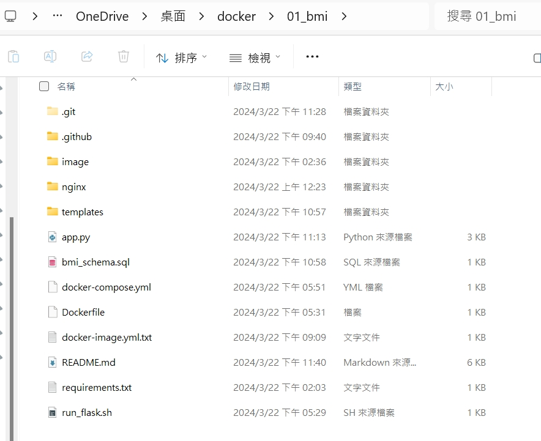
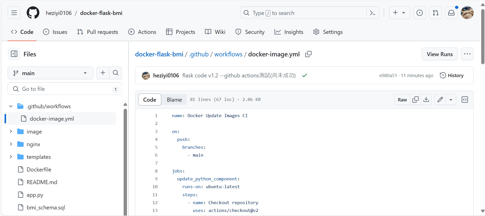
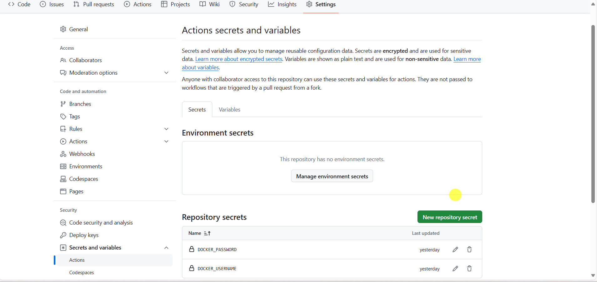
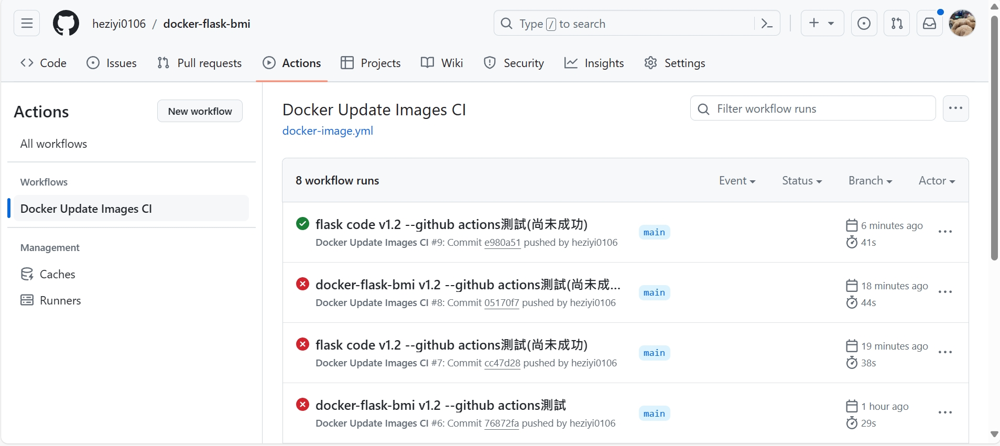

## 【教學】flask框架部署至docker，及換機部署docker環境

總共分三大方向來執行。

1. flask

   * 開啟docker，先將python映像檔pull下來。
   * 準備app.py和templates資料夾，置於C:\Users\user\OneDrive\Desktop\docker\01_bmi。
   * 準備requirements.txt，只需要Flask和mysql-connector-python兩個模組(或將需要的套件寫在Dockerfile)。
   * 打開Cmd，切換至指定路徑。 `cd /d C:\Users\user\OneDrive\Desktop\docker\01_bmi` 。
2. mysql

   * 先從本地匯出schema資料庫架構/邏輯或稱初始檔案，以及相關初始資料。於cmd內輸入 `mysqldump --no-defaults -u root -p --databases docker_flask --add-drop-database --add-drop-table --complete-insert > bmi_schema.sql`。
3. nginx 反向代理

   * 安裝nginx windows版本(1.25.4)，放入Program File內部，將此路徑先複製起來。
   * 同時將C:\Program Files\nginx-1.25.4\conf內的nginx.conf檔案複製到本專案下的C:\Users\user\OneDrive\Desktop\docker\01_bmi\nginx\nginx.conf內部。
   * 將上述兩個路徑複製，待會貼入docker-compose.yml文件。
4. 準備Dockerfile。
5. 建立Docker映像 ，`docker build -t myflask .` 。

   * 若有首次有建立成功，後續重複練習卻建立失敗時，重開機就能解決。
6. 準備docker-compose.yml文件

   * 定義flask應用程式、mysql、nginx的設定。
7. 啟動Docker容器，`docker-compose up`

   * docker會先拉mysql、nginx的映像檔。
   * port被占用情形，於docker-compose.yml修改映射主機的port號。
     * 在flask，若本機port:5000被占用，就要將 Flask 應用程序的容器端口進行修改，如"5001:5000"。
     * 在nginx，若本機port:80被占用，就要將 nginx 應用程序的容器端口修改，如"8188:80"。
     * 在mysql，若本機port:3306被占用，就要將mysql應用程序的容器端口修改，如"3307:3306"。
   * 這可以通過運行 `docker-compose down` 來停止容器，然後再運行 `docker-compose up` 或 `docker-compose up -d` 來重新啟動容器。這將應用新的 MySQL 連接設置並重新啟動 Flask 應用程式，原因在於docker啟動太快，可能還沒設置完畢就啟動flask，無法正確連接MySQL。
   * 若是mysql發生沒有資料表的情況，可能是docker-compose up產生問題，這時候只好手動新建資料表，並新增現有資料，語法詳見bmi_schema.sql。後來有發現可能是多了UNLOCK的語法，刪除即可在運行 `docker-compose up`的時候，新增資料庫後同時將資料表建立完成。
8. 三個容器皆建立好後，於網址分別檢查flask和nginx是否正常顯示，mysql的資料庫、資料表是否建立成功。

   * 網址輸入127.0.0.1:5000檢查flask頁面顯示。
   * 網址輸入127.0.0.1:8088檢查nginx頁面顯示。
   * mysql檢查則是通過輸入docker指令 `docker ps`查看現在執行中的容器，再輸入 `docker exec -it <mysql容器ID> bash `進入mysql容器內部登入檢查，輸入 `mysql -u <次最高的資料庫使用者> -p`，再輸入密碼來登入mysql 。
     * `show databases;` 展示所有資料庫
     * `use docker_flask` 使用指定資料庫
     * `show tables;` 顯示資料表
9. 於web首頁(127.0.0.1:5000)輸入身高體重資料，並且提交後，可以查看mysql的所有資料。可以看到docker上的資料比較新，本地端的資料比較舊。
10. 
11. 將本地docker推送到docker hub，先將image的命稱重新修改(複製自己的docker hub帳號)。

    * `docker tag myflask happy0106/flask_bmi_image`
    * `docker tag mysql happy0106/mysql_bmi_image`
    * `docker tag nginx happy0106/nginx_bmi_image`
12. 將映像檔push到docker

    * `docker push happy0106/flask_bmi_image`
    * `docker push happy0106/mysql_bmi_image`
    * `docker push happy0106/nginx_bmi_image`
13. push完成後，可以刪掉本地端的所有images。重新於docker進行pull。而我們本次使用**docker-compose**進行多容器的管理，所以我們必須打開Cmd，指定到有docker-compose.yml文件的資料夾下，輸入 `docker-compose pull`，系統就會根據文件中用到的所有鏡像逐一下載，如python、mysql、nginx。

    * 切記，docker-compoese.yml中的flask服務讀取的映像名稱，要寫完整名稱(tag後的名稱)，如happy0106/flask_bmu_image:latest。
    * 這樣可以正確 `docker-compose pull`。
14. 當映像檔皆下載後，輸入 `docker-compose up`，檢查環境是否有建立成功，可以參見步驟8的內容(完全一樣)。

---

## 【教學】更新github，透過github action自動更新docker images

1. 進入github中的**[docker-flask-bmi](https://github.com/heziyi0106/docker-flask-bmi)**專案。點擊Actions，左側欄可以點New workflow(新增工作流)，往下拉找到docker的模板點Configure(配置)。
2. 修改.yml文件，讓github偵測main分支，每偵測到一次推送，就更新並建立python和mysql的docker映像檔，並且將docker映像檔推送到docker hub。

   * 要透過github actions來自動連線docker的話，須先建立secrets.DOCKER_USERNAME、secrets.DOCKER_PASSWORD，可以到Settings下拉看到Security，點擊Actions進去建立兩個secrets。
3. 嘗試更新本地的app.py，更新後先push到git上。理論上會自動更新docker image，可以打開actions看自動更新是否成功。

   
4.
